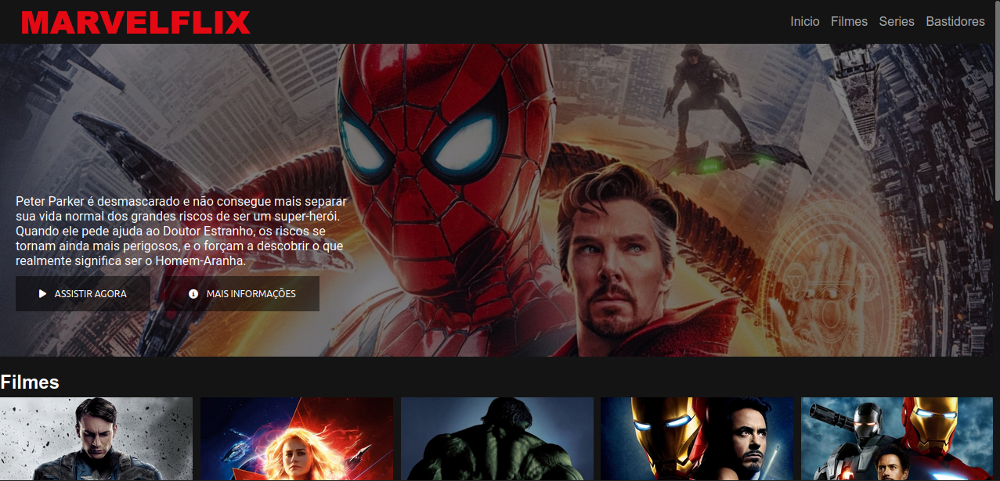
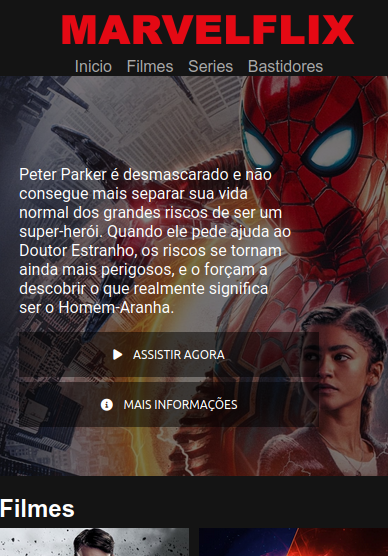

<h1 align="center"> marvel-flix </h1>

  <a href="#-tecnologias">Tecnologias</a>&nbsp;&nbsp;&nbsp;|&nbsp;&nbsp;&nbsp;
  <a href="#-projeto">Projeto</a>&nbsp;&nbsp;&nbsp;|&nbsp;&nbsp;&nbsp;
  <a href="#memo-licença">Licença</a>

  

 

<h2>Desktop:</h2>
  
  
 <h2>Mobile:</h2>
  

## 🚀 Tecnologias

Esse projeto foi desenvolvido com as seguintes tecnologias:

- HTML
- CSS
- JavaScript
- Plugins JQuery

## 💻 Projeto

Projeto desenvolvido no curso da Digital Innovation One com o objetivo de recriar o layout do site de streaming Netflix, usando como filmes e series o universo cinematográfico da Marvel.

## :memo: Licença

Esse projeto está sob a licença MIT.

---
